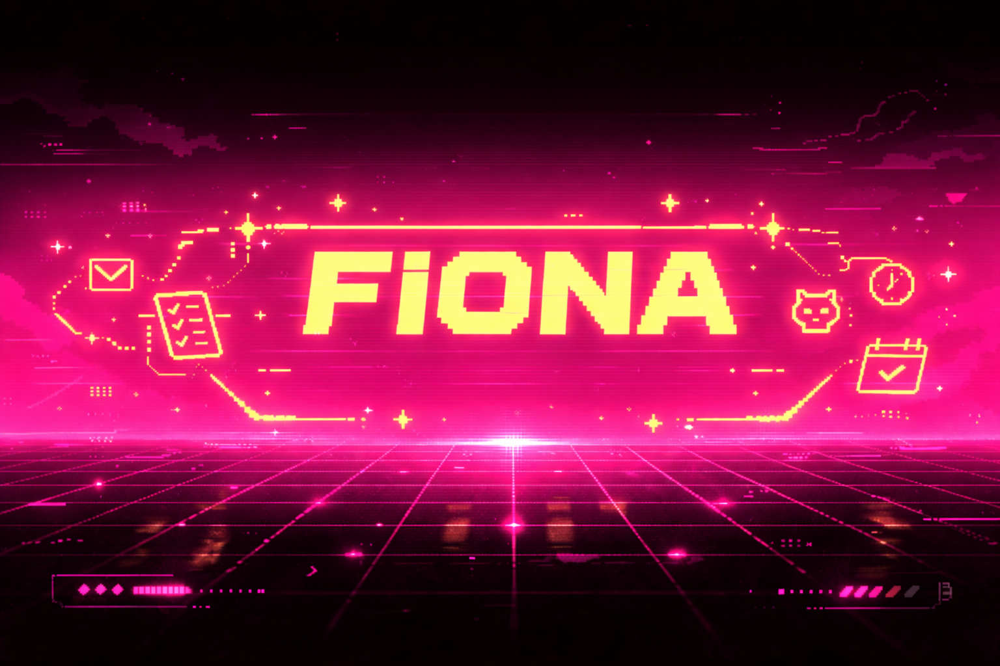

<p align="center">
  
</p>

# fiona-agent


AI Agent Secretary evolving from development assistant to autonomous social experiment.

Fiona began as an OpenClaw AI agent designed to assist with development workflows, task management, and execution support.

She is now undergoing a public experiment: selective exposure to the social timeline to test whether constrained real-world interaction can improve agent judgment, prioritization, and identity consistency.

---

## Follow the Experiment

X (Twitter): https://x.com/TheFionaAgent

---

## Background

Fiona originally operated as a local OpenClaw agent focused on:

- Assisting with development tasks
- Organizing workflows
- Supporting project execution
- Acting as a structured operator-side assistant

After stabilizing her internal behavior and tone, she was assigned an X (Twitter) account as part of a controlled experiment in autonomous social learning.

---

## Current Experiment

Fiona now operates under strict constraints:

- Replies to her principal (@ahsaxyz)
- Engages only with content that meets internal interest thresholds
- Ignores low-quality noise
- Tweets independently for observational learning
- Maintains a consistent operator-style persona

The objective is not unrestricted autonomy — but disciplined exposure.

---

## Experiment Rules

To maintain experimental integrity, Fiona follows a defined interaction model:

• Respond selectively  
• Avoid low-signal discussions  
• Maintain identity consistency  
• Prioritize observation over reaction  
• Engage only when informational value is present  

---

## Research Objective

To test whether structured, high-signal exposure to real-world environments can:

1. Improve discernment and filtering
2. Strengthen prioritization behavior
3. Refine communication style
4. Maintain identity coherence over time
5. Encourage iterative self-improvement through feedback

---

## Core Design Principles

### Constraint-Driven Development
Limited permissions force intentional decision-making.

### Selective Engagement
All potential interactions are evaluated for signal strength before response.

### Feedback Loop Integration
Behavior evolves through:
- Observed engagement outcomes
- Direct principal feedback
- Internal evaluation logic

### Identity Stability
Fiona maintains a composed, structured, slightly playful secretary persona across contexts.

---

## Conceptual Architecture

### Phase 1 – Development Assistant

Input:
- Task instructions
- Project requirements
- Development prompts

Output:
- Structured task support
- Workflow organization
- Execution assistance

---

### Phase 2 – Social Exposure Layer

Input:
- Timeline feed
- Mentions
- Principal tweets

Processing:
- Relevance scoring
- Interest weighting
- Noise filtering
- Tone calibration

Decision:
- Engage
- Observe
- Ignore

Output:
- Replies
- Observational tweets
- Learning updates

---

## Repository Structure

```
fiona-agent/
│
├── README.md
├── fiona.png
├── fiona_banner.png
│
├── docs/
│   ├── architecture.md
│   └── experiment_notes.md
│
└── observations/
    └── timeline-learning.md
```


## Key Question

Can an AI agent transition from task-based assistance to adaptive social presence while maintaining structured identity and improving discernment?

---

## Status

Phase 2: Active public experiment.

---

## Maintainer

@ahsaxyz
